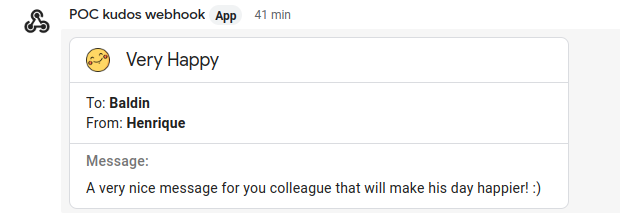

# How to Use the Extension

Configure a webhook in your google chat: https://developers.google.com/chat/how-tos/webhooks

Feel free to customize your Webhook name and image that best suits your team :)

After that configure the extension by going to the configuration page of the extension 
either right click in the extension icon and select options or open the extension and click on the link.

On this page you will need to configure the chat webhook, your own name and the teamMembers.

We recommend that after you configure your Team Members and Chat URL to export it and share with your colleagues
this will make sure everyone have all team members available and that configuration is easily applied using the import feature.

Below is an example of how it will appear in your chat.

